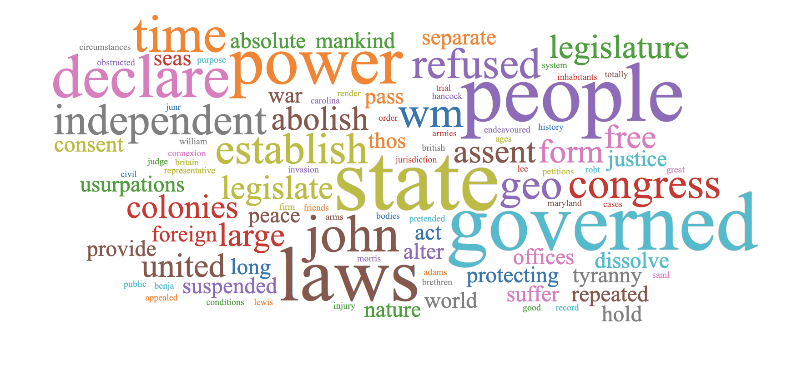

# React Wordcloud

React + D3 word cloud component with rich features.  Uses the [`d3-cloud`](https://github.com/jasondavies/d3-cloud) layout.



## Install

```bash
yarn add https://github.com/chrisrzhou/react-wordcloud.git
```

## Simple Example

Using only required props:
```js
import * as React from 'react';
import ReactWordcloud from 'react-wordcloud';

const words = [
  {word: 'hello', value: 3},
  {word: 'world', value: 1},
  {word: 'github', value: 1},
  {word: 'code', value: 1},
];

const wordCountKey = 'value';
const wordKey = 'word';

function MyWordcloud() {
  return (
    <div style={{width: 600, height: 400}}>
      <ReactWordcloud
        words={words}
        wordCountKey={wordCountKey}
        wordKey={wordKey}
      />
    </div>
  );
};

export default MyWordCloud;
```

## Documented Examples
View all documented examples at https://worcloud.chrisrzhou.io.

You can also run the examples locally:
```bash
yarn dev
```

## Wordcloud Generator
Create wordclouds using this [wordcloud generator](https://github.com/chrisrzhou/wordcloud-generator).

The generator supports:
- Copy/paste/edit/upload text inputs
- Wordcloud configurations
- Export/save/share wordclouds